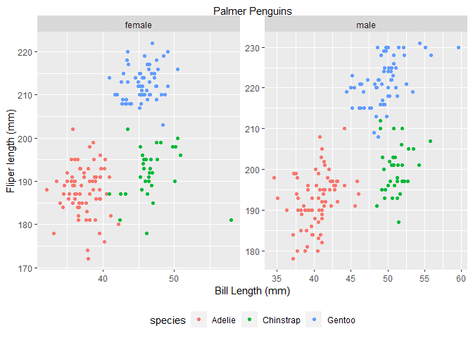

PubH 7462 Homework1 Problem2
================
You Shan Shen
2022/2/1

``` r
library(tidyverse)

penguin.df <- read_rds("./data/penguin.RDS")

library(dplyr)

number_row <- nrow(penguin.df)

number_col <- ncol(penguin.df)

mu_fliper <- mean( penguin.df$flipper_length_mm, na.rm = TRUE ) %>% 
             round( digits = 3)

sd_fliper <- sd(penguin.df$flipper_length_mm, na.rm = TRUE) %>% 
            round( digits = 3)

mu_bill <- mean( penguin.df$bill_length_mm, na.rm = TRUE ) %>% 
           round( digits = 3)

sd_bill <- sd(penguin.df$bill_length_mm, na.rm = TRUE) %>%  
           round( digits = 3)
```

Penguins data set has 344 observations and 8 variables. Species is a
factor denoting penguin species (Adélie, Chinstrap and Gentoo).

Island is a factor denoting island in Palmer Archipelago, Antarctica
(Biscoe, Dream or Torgersen).

Bill length is a number denoting bill length (millimeters).

Bill depth is a number denoting bill depth (millimeters).

Flipper length is an integer denoting flipper length (millimeters).

Body mass is an integer denoting body mass (grams)

Sex is a factor denoting penguin sex (female, male).

Year is an integer denoting the study year (2007, 2008, or 2009).

The mean and standard deviation of flipper is 200.915 and 14.062
respectively.

The mean and standard deviation of bill length is 43.922 and 5.46
respectively.

``` r
library(ggplot2)
penguin.df %>%
drop_na %>%
ggplot(aes(x = bill_length_mm , y = flipper_length_mm)) +
geom_point(aes(color=species)) +
facet_wrap(~sex, scales= "free" ) +
ggtitle( "Palmer Penguins" ) +
xlab( "Bill Length (mm)" ) + 
ylab( "Fliper length (mm)" )
```

<!-- -->

Comparing the two genders, the plot shows that male palmer pengiuns have
longer bill length in all species. However, flipper length has no
difference between genders in all species.

Comparing the three species, the plot shows that Gentoo has the longest
bill and flipper length. Adelie has the shortest bill and flipper
length.
