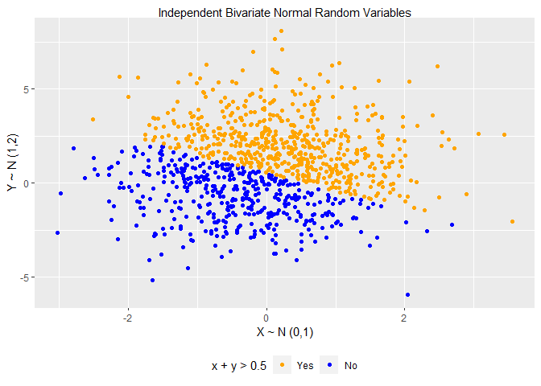

PubH 7462 Homework2 Problem1
================
You Shan Shen
2022/2/2

``` r
knitr::opts_knit$set(echo = TRUE, warning = FALSE,results = 'hide' ,
root.dir = rprojroot::find_rstudio_root_file())
library(tidyverse)
```

    ## -- Attaching packages --------------------------------------- tidyverse 1.3.1 --

    ## v ggplot2 3.3.5     v purrr   0.3.4
    ## v tibble  3.1.6     v dplyr   1.0.7
    ## v tidyr   1.1.4     v stringr 1.4.0
    ## v readr   2.1.1     v forcats 0.5.1

    ## -- Conflicts ------------------------------------------ tidyverse_conflicts() --
    ## x dplyr::filter() masks stats::filter()
    ## x dplyr::lag()    masks stats::lag()

``` r
theme_set(theme(plot.title = element_text(hjust = 0.5), legend.position = "bottom"))
```

``` r
library(tibble)
library(dplyr)
library(reshape)
```

    ## 
    ## 載入套件：'reshape'

    ## 下列物件被遮斷自 'package:dplyr':
    ## 
    ##     rename

    ## 下列物件被遮斷自 'package:tidyr':
    ## 
    ##     expand, smiths

``` r
library(forcats)
library(ggplot2)

Normal_random_sample <- tibble(
 X=rnorm(mean = 0, sd = 1, n = 1000),
 Y=rnorm(mean = 1, sd = 2, n=  1000),
 sum_indicator=ifelse( X + Y > 0.5,"True","False")
) 


Normal_random_sample$'x + y > 0.5' <- recode(Normal_random_sample$sum_indicator, `True`="Yes", `False`="No")

Normal_random_sample$'x + y > 0.5' <- as.factor(Normal_random_sample$'x + y > 0.5')


Normal_random_sample$`x + y > 0.5` <- fct_relevel( Normal_random_sample$`x + y > 0.5`, c("Yes","No") )
str(Normal_random_sample)
```

    ## tibble [1,000 x 4] (S3: tbl_df/tbl/data.frame)
    ##  $ X            : num [1:1000] -1.896 -0.601 -0.627 -1.33 -0.124 ...
    ##  $ Y            : num [1:1000] -0.982 0.625 -0.64 1.903 0.747 ...
    ##  $ sum_indicator: chr [1:1000] "False" "False" "False" "True" ...
    ##  $ x + y > 0.5  : Factor w/ 2 levels "Yes","No": 2 2 2 1 1 2 2 2 1 1 ...

``` r
ggplot(Normal_random_sample, aes(x = X , y = Y)) +
geom_point(aes(color = `x + y > 0.5`)) +
scale_color_manual(values = c("orange", "blue")) +  
ggtitle( "Independent Bivariate Normal Random Variables" ) +
xlab( " X ~ N (0,1) " ) + 
ylab( " Y ~ N (1,2) " )
```

<!-- -->
